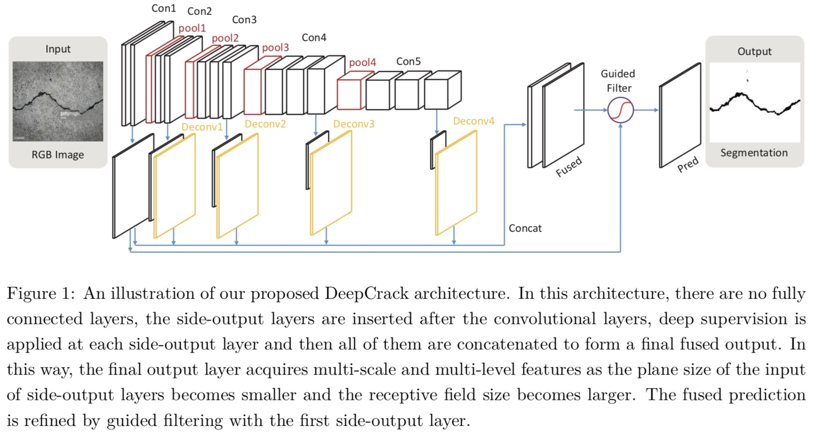

## Crack Detection

This repository contains the code for crack detection on concrete surfaces. It is a PyTorch implementation of Deep Learning-Based Crack Damage Detection Using Convolutional Neural Networks with DeepCrack
The code is constructed on the project to be completed by Coursera on AI Capstone Project with Deep Learning

Dataset can be downloaded directly from the notebook (other link https://data.mendeley.com/datasets/5y9wdsg2zt/2)

Dataset: The dataset contains concrete images having cracks. 
The dataset is divided into two as negative and positive crack images for image classification. 
Each class has 20000 images with a total of 40000 images with 224 x 224 pixels with RGB channels.

